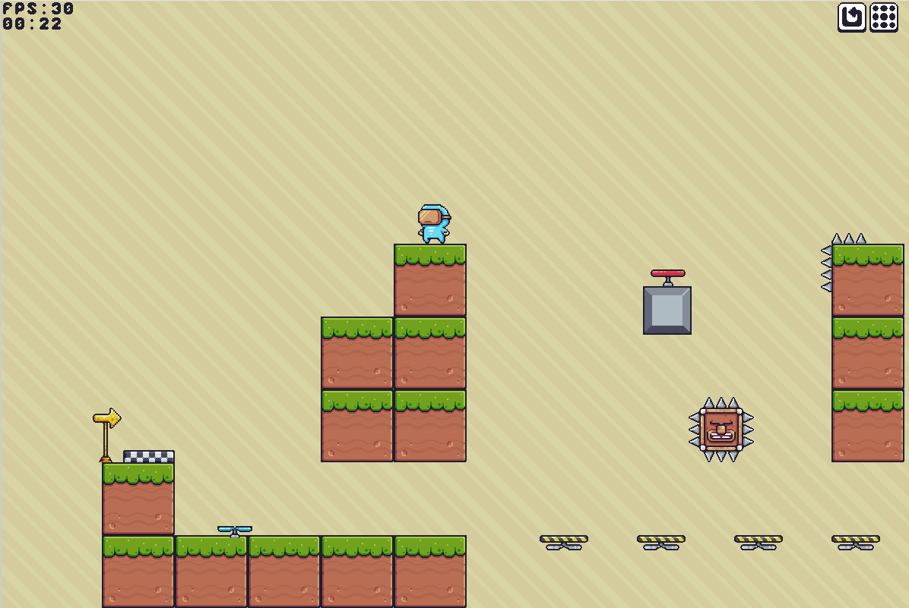
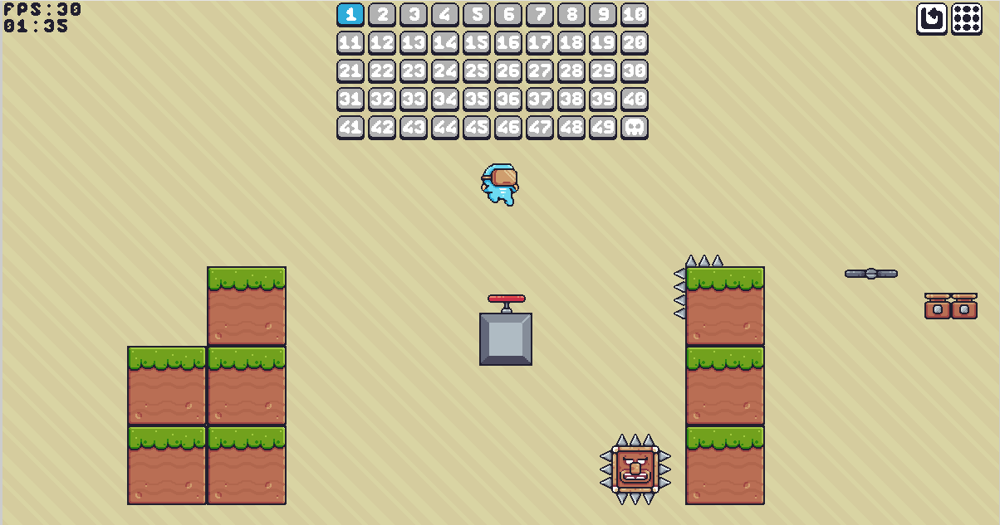
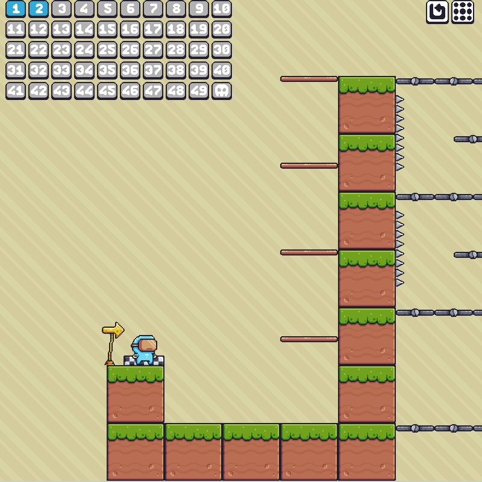
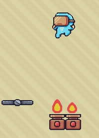
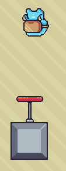
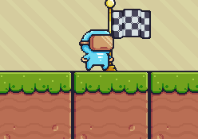

# Python Platformer Game

Un **jeu de plateforme en Python**, développé avec **Pygame**, inspiré du tutoriel YouTube de [freeCodeCamp.org](https://www.youtube.com/watch?v=6gLeplbqtqg).

Il s’agit d’un projet personnel visant à améliorer mes compétences en développement Python, Pygame et conception de jeux vidéo.
Le projet contient plusieurs niveaux, des pièges, des animations, des particules, et un système de progression.

---

## 🎮 Description

Ce jeu est un platformer classique :  
- Sauts, double sauts  
- Plateformes mouvantes  
- Pics, pièges, ventilateurs, projectiles  
- Checkpoints, chrono, score  
- Animation des personnages et des éléments  

J’ai ajouté des améliorations par rapport au tutoriel de base :  
- Sprites ajoutés
- Possibilité de double saut
- Ajouts de fruits comme score
- Ajout d'une option d'attaque

---

## 📷 Captures d’écran

| Image | Description |
|----------|--------|
|  | Un aperçu du premier niveau avec des plateformes simples et des pièges basiques.|
|  | La sélection des niveaux disponibles dans le jeu, avec plus de 50 niveaux débloquables.|
|  |Un aperçu du second niveau.|
|  | Le joueur saute au-dessus de pièges de feu : attention à bien calculer son saut !|
|  | Le joueur utilise un trampoline pour rebondir plus haut et atteindre des plateformes.|
|  |Le joueur atteint un point de contrôle (checkpoint) qui enregistre sa progression.|

---

## 🚀 Lancer le jeu

Assurez-vous d’avoir installé Python (>= 3.9) et Pygame.

```bash
# Cloner le repo
git clone https://github.com/ton-github/ton-projet.git
cd ton-projet

# Installer les dépendances
pip install pygame

# Lancer le jeu
python game.py
